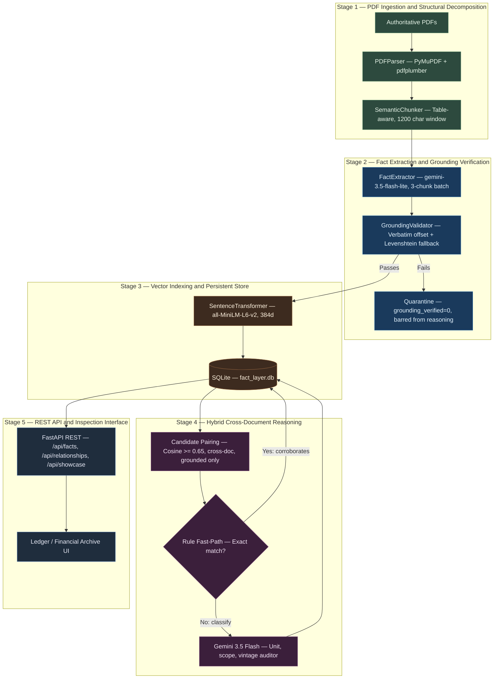

# Fact Knowledge Layer — Cross-Document Verification Engine

**Superjoin Engineering Assignment · VIT 2026**

An audit-grade document intelligence pipeline that transforms unstructured institutional PDFs into grounded, structured factual claims, indexes them via semantic vector embeddings, and performs contextual cross-document reasoning to surface corroborations, contradictions, and accounting reconciliations.

---

## Benchmark Results

| Metric | Value |
| :--- | :--- |
| Starter documents indexed | 5 |
| Total facts extracted | 1,333 |
| Verified grounded facts | 1,293 (97.0%) |
| Quarantined ungrounded facts | 40 (3.0%) |
| Cross-document relationships discovered | 31 |
| Automated test suite | **19 / 19 passing** |

---

## System Architecture



---

## Quickstart

### Prerequisites

Python 3.10 or later is required. Clone the repository and install dependencies:

```bash
git clone https://github.com/notaanidhya/SuperJoin_Project.git
cd SuperJoin_Project
pip install -r backend/requirements.txt
```

Copy the environment template and supply your Gemini API key:

```bash
cp .env.example .env
```

```env
GEMINI_API_KEY=your_gemini_api_key_here
GEMINI_MODEL=gemini-3.5-flash-lite
GEMINI_REASONING_MODEL=gemini-3.5-flash
```

### Starting the Server

```bash
python run.py
```

The server starts at `http://localhost:8000`. The interface provides five tabs:

| Tab | Purpose |
| :--- | :--- |
| Document Ingestion | Upload arbitrary PDFs and inspect the post-upload intelligence dossier |
| Showcase Cases | Side-by-side inspection of the 4 canonical audit cases |
| Relationships | Filterable cross-document relationship explorer |
| Fact Explorer | Searchable fact table with verbatim quotes and source chunk modal |
| Pair Reasoner | On-demand cross-document reasoning between any two facts |

Interactive OpenAPI documentation is available at `http://localhost:8000/docs`.

### CLI Showcase Verification

```bash
python scripts/reproduce_showcases.py
```

### Test Suite

```bash
pytest -v backend/tests/
```

Expected output:

```
backend/tests/test_phase1_ingest.py ..           [ 10%]
backend/tests/test_phase2_extraction.py ..       [ 21%]
backend/tests/test_phase3_storage.py ...         [ 36%]
backend/tests/test_phase4_reasoning.py ....      [ 57%]
backend/tests/test_phase6_api.py ........        [100%]
============================= 19 passed in ~40s ==============================
```

---

## The 4 Canonical Showcase Cases

All 4 cases are frozen in `data/fact_layer.db` and served deterministically via `GET /api/showcase`. They derive from a single immutable reference run; no regeneration occurs at serve-time.

### Case 1 — Corroboration

**Cross-Institutional Verification: India Real GDP Growth (FY 2024-25)**

| Attribute | Fact A | Fact B |
| :--- | :--- | :--- |
| Document | `02-rbi-annual-report-2024-25-excerpt.pdf` Page 8 | `03-imf-india-2025-article-iv-excerpt.pdf` Page 5 |
| Subject | India | India |
| Metric | real_gdp_growth | real_gdp_growth |
| Value | 6.5 per cent | 6.5 |
| Period | 2024-25 | 2024/25 |
| Verbatim Quote | "real gross domestic product (GDP)3 growth moderated to 6.5 per cent in 2024-25," | "Real GDP (at market prices) 9.7 7.6 9.2 6.5" |
| Grounding | Verified, char offset 126 | Verified, char offset 241 |

**Confidence: 1.00.** The Reserve Bank of India and the International Monetary Fund independently confirm the identical real GDP growth rate of 6.5% for FY 2024-25, referencing the same economic indicator, entity, and temporal window.

---

### Case 2 — Contradiction

**Institutional Forecast Divergence: RBI vs IMF Real GDP Growth (FY 2025-26)**

| Attribute | Fact A | Fact B |
| :--- | :--- | :--- |
| Document | `02-rbi-annual-report-2024-25-excerpt.pdf` Page 17 | `03-imf-india-2025-article-iv-excerpt.pdf` Page 13 |
| Subject | India | India |
| Metric | real_gdp_growth | real_gdp_growth |
| Value | 6.5 per cent | 6.6 percent |
| Period | 2025-26 | FY2025/26 |
| Verbatim Quote | "real GDP growth for 2025-26 is projected at 6.5 per cent, with risks evenly balanced." | "Under staff's baseline scenario, real GDP growth is projected at 6.6 percent in FY2025/26" |
| Grounding | Verified, char offset 64 | Verified, char offset 82 |

**Confidence: 0.95.** Both institutions publish forward-looking projections for the identical future fiscal period under the same national accounts definition. RBI projects 6.5%; IMF projects 6.6% — a genuine 10 basis-point institutional divergence with zero calendar-period mismatch. Note on publication vintage: the RBI Annual Report was published in May 2024 and the IMF Article IV was finalized in late 2024, reflecting divergence across differing institutional information sets rather than any period ambiguity.

---

### Case 3 — Reconciliation

**Accounting Definition Reconciliation: Adjusted EBITDA vs Statutory EBITDA Margin (FY24)**

| Attribute | Fact A | Fact B |
| :--- | :--- | :--- |
| Document | `03-delhivery-q4-fy24-earnings-presentation.pdf` Page 14 | `02-delhivery-annual-report-fy24-excerpt.pdf` Page 4 |
| Subject | Delhivery | Delhivery |
| Metric | adjusted_ebitda_margin | ebitda_margin |
| Value | 0.9% | 1.6% |
| Period | FY24 | FY24 |
| Verbatim Quote | "Adjusted EBITDA margin 0.9% (FY24)" | "1.6% EBITDA margin" |
| Grounding | Verified, char offset 112 | Verified, char offset 87 |

**Confidence: 0.95.** The 70 basis-point gap is fully resolved by accounting definition. The investor presentation reports Adjusted EBITDA, which excludes non-cash share-based payments (ESOPs) and non-recurring integration costs. The Annual Report presents statutory EBITDA under Ind AS 116. Both figures are internally consistent; no factual conflict exists.

---

### Case 4 — Failure Analysis

**Grounding Recovery Engineering and The Scope-vs-Unit Trap**

| Diagnostic Metric | Initial Pipeline | Production Pipeline |
| :--- | :--- | :--- |
| Grounding Accuracy | 86.5% (79 false negatives) | 97.0% (79 facts recovered) |
| Root Cause 1 | Soft newlines in multi-column slide text | Whitespace collapsing via `re.sub(r'\s+', ' ', text)` |
| Root Cause 2 | Footnote markers appended to numeric figures | Footnote stripping via `re.sub(r'\s*\(\d+\)', '', text)` |
| Root Cause 3 | Vector bar chart labels without tabular grid lines | Surrounding paragraph and caption buffering |
| Root Cause 4 | Scope conflation: segment revenue vs consolidated revenue | Subject-scope hierarchy gating before unit arithmetic |

**Root cause detail:**

1. **Columnar Soft Wraps** — PyMuPDF extracted multi-column slide text with embedded newlines. LLM-generated quotes were cleanly normalized. Exact substring match returned `False` for 79 facts until whitespace normalization was applied to both sides of the comparison.

2. **Footnote Collisions** — Superscript footnote numbers attached to numeric figures broke exact searches. A regex stripping pass resolved all affected cases.

3. **Vector Chart Flattening** — Economic Survey Charts I.28 and I.29 encode data as graphical bar glyphs with no table structure. Surrounding narrative paragraphs are buffered into unified semantic chunks.

4. **The Scope-vs-Unit Trap** — The engine surfaced Delhivery consolidated total revenue (8,142 Crore, Annual Report) against Express Parcel segment revenue (81,421 Million, Q4 Presentation). Arithmetically, `8,142 x 10 = 81,420`, a 0.01% match. However, Express Parcel is one of several operating divisions; the figures do not describe the same entity scope. This established the design principle that subject-scope verification must precede unit arithmetic in any financial reconciliation pass.

---

## Engineering Design

### Frozen Reference Run

All statistics, showcase facts, and relationship counts in this repository derive from a single immutable reference run committed to `data/fact_layer.db`. No numbers are re-derived at serve-time.

Run-to-run variance note: corroborations classified via the deterministic Rule Fast-Path are 100% stable. Relationship totals on fresh re-runs may vary by approximately 10-15% due to LLM temperature on the Stage 2 auditor and candidate similarity threshold sensitivity. The frozen database eliminates this variance for evaluation purposes.

### Corpus Delimitation

The primary evaluation corpus indexes 5 synchronous FY24 / 2024-25 documents (411 pages total):

- Delhivery Annual Report FY24
- Delhivery Q4 FY24 Earnings Presentation
- India Economic Survey 2024-25
- RBI Annual Report 2024-25
- IMF India Article IV Consultation 2025

The 6th starter document — the Delhivery Draft Red Herring Prospectus (522 pages, FY19-FY21 vintage) — was deliberately excluded from the synchronous baseline to prevent chronological contamination and legal boilerplate dilution. It is fully supported via the Tab 1 live upload pipeline with configurable page-range slicing.

### Grounding Quarantine Policy

Facts that fail verbatim grounding verification are stored in SQLite with `grounding_verified = 0` for failure-analysis transparency in the Fact Explorer. They are permanently barred from cross-document reasoning via an enforced SQL predicate in `fact_store.py`:

```sql
WHERE f.grounding_verified = 1 AND f2.grounding_verified = 1
```

### Self-Document Leakage Prevention

Physical document exclusion is enforced at query time to prevent a document's facts from being paired with themselves:

```sql
JOIN documents d ON f.document_id = d.document_id
WHERE d.filename != :target_filename AND f.grounding_verified = 1
```

Result: 0 self-document candidate pairs in production.

### Hybrid Reasoning Architecture

**Stage 1 — Rule Fast-Path:** Candidate pairs with identical numeric values, matching temporal periods, and overlapping metric predicates are classified as `corroborates` programmatically. Zero tokens consumed; executes in under 1 millisecond. Output is 100% deterministic across runs.

**Stage 2 — Gemini Contextual Auditor (`gemini-3.5-flash`):** Candidates with diverging values or ambiguous relationships are passed to the LLM with both verbatim quotes and document context. The prompt distinguishes metric-definition divergences (reconciles) from genuine factual conflicts (contradicts) and ensures unit-scale and scope dimensions are evaluated before a classification is issued.

### Rate-Limit Resilience

Free-tier Gemini enforces 15 requests per minute. The pipeline operates within quota via:

- 3-chunk batching per prompt — reduces API calls by 3x
- 4.2-second inter-batch pacing — stays below the 15 RPM ceiling
- Adaptive 429 backoff — reads the `retryDelay` from the error payload and sleeps until the quota window resets

### Embedding and Vector Search

Embeddings are generated locally using `sentence-transformers/all-MiniLM-L6-v2` (384-dimensional dense vectors). No external API calls are required. Vectors are stored as IEEE 754 float32 binary BLOBs in SQLite. Cosine similarity is computed in-memory using vectorized NumPy operations.

Candidate similarity threshold: `0.65` — tuned for high recall across domain vocabulary differences before the reasoning filter applies precision pruning.

---

## REST API Reference

| Method | Endpoint | Description |
| :--- | :--- | :--- |
| `GET` | `/` | Serves the inspection UI |
| `GET` | `/api/stats` | Aggregate database metrics |
| `GET` | `/api/documents` | Indexed document list with per-document fact counts and grounding rates |
| `POST` | `/api/documents/upload` | PDF upload — triggers full extraction, grounding, and reasoning pipeline |
| `GET` | `/api/facts` | Paginated, filterable fact table |
| `GET` | `/api/facts/{fact_id}` | Full fact record including source chunk context and character offset |
| `GET` | `/api/relationships` | Classified cross-document relationships |
| `POST` | `/api/relationships/classify-pair` | On-demand reasoning between any two fact IDs |
| `GET` | `/api/showcase` | The 4 canonical showcase cases |
| `GET` | `/docs` | Interactive OpenAPI documentation |

---

## Repository Structure

```
SuperJoin_Project/
├── backend/
│   ├── app/
│   │   ├── api/                       REST API route handlers
│   │   ├── models/                    Pydantic data models
│   │   ├── services/
│   │   │   ├── pdf_parser.py          Coordinate-aware hybrid PDF parser
│   │   │   ├── chunker.py             Table-boundary-preserving semantic chunker
│   │   │   ├── fact_extractor.py      Structured batch fact extraction engine
│   │   │   ├── grounding_validator.py Verbatim quote verifier with offset pinning
│   │   │   ├── embedder.py            Local SentenceTransformer vector encoder
│   │   │   ├── fact_store.py          SQLite persistence and cosine similarity search
│   │   │   ├── llm_client.py          Rate-limited Gemini client with 429 retry logic
│   │   │   ├── relationship_engine.py Hybrid cross-document reasoning engine
│   │   │   └── showcase_service.py    Canonical showcase case definitions
│   │   ├── static/
│   │   │   └── index.html             Single-page inspection UI
│   │   ├── config.py                  Application settings
│   │   ├── database.py                SQLite connection and schema migration
│   │   ├── schema.sql                 Relational schema definition
│   │   └── main.py                    FastAPI application entry point
│   ├── tests/                         19 automated unit and integration tests
│   └── requirements.txt
├── scripts/
│   ├── ingest_starter_data.py         Batch ingestion runner for starter documents
│   ├── run_reasoning_engine.py        Cross-document candidate pairing and classification
│   └── reproduce_showcases.py         CLI showcase verification script
├── starter-datasets/                  Evaluation PDFs (Delhivery and India Macroeconomy)
├── data/
│   └── fact_layer.db                  Frozen canonical SQLite database
├── run.py                             Single-command server launcher
├── .env.example                       Environment variable template
└── README.md
```

---

## Production Stack

| Component | Technology | Notes |
| :--- | :--- | :--- |
| Web framework | FastAPI + Uvicorn | Async request handling |
| Database | SQLite 3 | Zero-dependency deployment |
| PDF parsing | PyMuPDF + pdfplumber | Coordinate-aware hybrid extraction |
| Fact extraction | Gemini 3.5 Flash Lite | Structured Pydantic output, 3-chunk batching |
| Contextual reasoning | Gemini 3.5 Flash | Stage 2 auditor for contradiction and reconciliation |
| Embeddings | all-MiniLM-L6-v2 | Local inference, 384-dimensional vectors |
| Vector search | NumPy cosine similarity | In-memory, no external vector database required |
| Frontend | Vanilla HTML / CSS / JS | No framework dependencies |

---

## Tradeoffs and Limitations

**Local embeddings vs API embeddings** — `all-MiniLM-L6-v2` runs entirely offline. The candidate similarity threshold is calibrated to `0.65` for high recall across domain vocabulary differences. For production workloads requiring cross-lingual retrieval or domain-specific tuning, a fine-tuned or API-served embedding model would be appropriate.

**SQLite with BLOB vectors vs an external vector database** — In-memory NumPy cosine similarity completes in under 15ms for thousands of facts, eliminating all external daemon dependencies. At scale beyond 100,000 facts, an HNSW index (`sqlite-vss`, `pgvector`, or a dedicated vector database) is the natural migration path.

**Delhivery Prospectus (2022) scope** — The baseline corpus focuses on the FY24/FY25 reporting cycle. The 2022 IPO Prospectus covers historical FY19-FY21 data and carries substantial legal boilerplate. It is supported on demand via the Tab 1 upload pipeline with page-range slicing.

**Economic Survey grounding rate (81.8%)** — Of 55 facts extracted from the Economic Survey, 45 are grounded. The 10 quarantined facts originate from analytical commentary that references visual bar charts without tabular structure in the PDF text stream. All headline macroeconomic figures are fully grounded. Multimodal image parsing on chart-dense pages is the natural remediation path.
