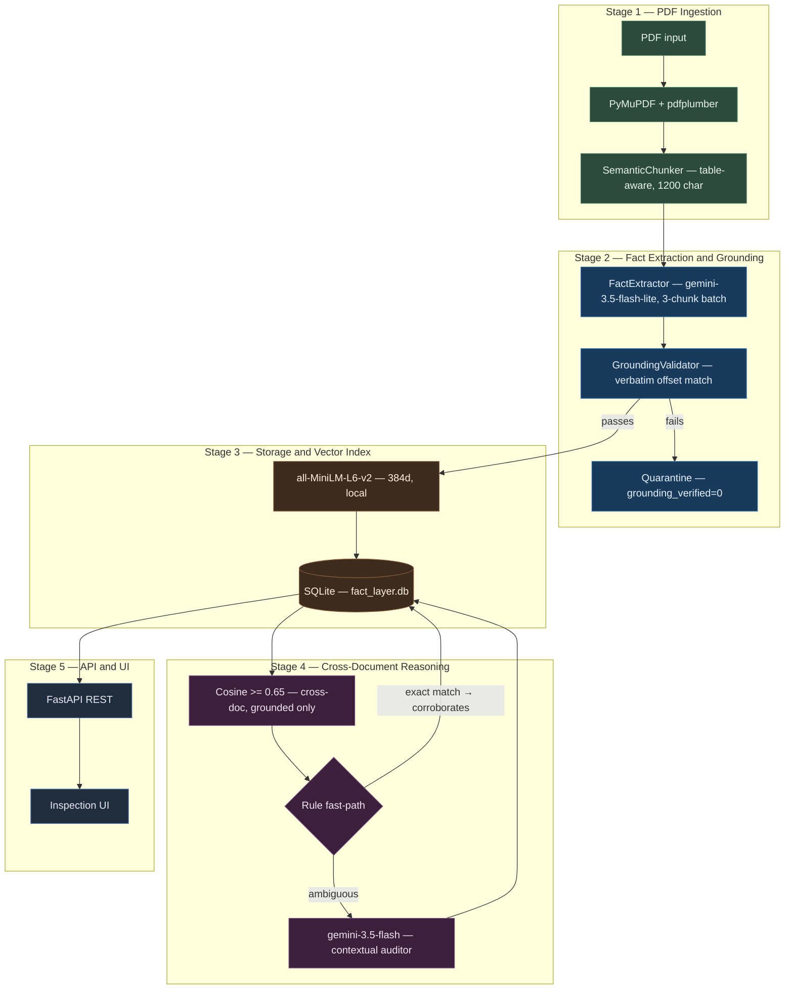

# Fact Knowledge Layer

A system for extracting, grounding, and cross-referencing factual claims across institutional PDFs.

Given a set of documents — annual reports, earnings presentations, macroeconomic surveys — the pipeline extracts every meaningful numerical or semantic claim, verifies it against a verbatim quote from the source text, and then reasons about how claims from different documents relate to each other: do they agree, disagree, or does the apparent conflict dissolve once you account for accounting definitions or reporting scope?

The problem that motivated the approach: standard RAG systems retrieve text but do not reason about whether two retrieved passages are saying the same thing or contradicting each other. Auditors and analysts do that reasoning manually. This system automates it at the claim level, not the document level.

---

## Demo Video

> **[Watch the 3-minute walkthrough on YouTube](https://www.youtube.com/watch?v=FP1CKIIMhjE)**
>
> Covers: live PDF upload, post-ingestion claim ledger, all 4 showcase cases, and the fact grounding evidence modal.

---

## Results on the Starter Corpus

| Metric | Value |
| :--- | :--- |
| Documents indexed | 5 |
| Facts extracted | 1,333 |
| Grounded with verbatim quotes | 1,293 (97.0%) |
| Quarantined (unverified) | 40 (3.0%) |
| Cross-document relationships | 31 |
| Automated tests passing | 19 / 19 |

The 5 documents are Delhivery FY24 Annual Report, Delhivery Q4 FY24 Earnings Presentation, India Economic Survey 2024-25, RBI Annual Report 2024-25, and IMF India Article IV 2025. A 6th document (Delhivery 2022 IPO Prospectus) was deliberately excluded from the synchronous baseline — it covers historical FY19–FY21 financials and would contaminate contemporary FY24 comparisons. It remains available in `starter-datasets/` and is supported on demand via the live upload tab to verify out-of-sample processing on a 500+ page institutional filing.

---

## Setup and Run

### Requirements

Python 3.10 or later. Clone the repository and install:

```bash
git clone https://github.com/notaanidhya/SuperJoin_Project.git
cd SuperJoin_Project
pip install -r backend/requirements.txt
```

Create a `.env` file with your Gemini API key:

```env
GEMINI_API_KEY=your_gemini_api_key_here
GEMINI_MODEL=gemini-3.5-flash-lite
GEMINI_REASONING_MODEL=gemini-3.5-flash
```

### Start the server

```bash
python run.py
```

Open `http://localhost:8000`. The pre-built database (`data/fact_layer.db`) loads immediately with all 1,333 facts and 31 relationships — no re-ingestion required.

The interface has five tabs:

| Tab | What it does |
| :--- | :--- |
| Document Ingestion | Upload any arbitrary, unseen PDF (with configurable page slicing) to run end-to-end extraction, grounding, and cross-document reasoning live |
| Showcase Cases | The 4 required cases with side-by-side fact comparison |
| Relationships | All 31 discovered relationships, filterable by type |
| Fact Explorer | Search and browse all 1,333 facts; click any row for the source chunk and highlighted quote |
| Pair Reasoner | Pick any two facts and run on-demand reasoning |

OpenAPI docs: `http://localhost:8000/docs`

### Reproduce the showcase cases from the CLI

```bash
python scripts/reproduce_showcases.py
```

### Run the tests

```bash
pytest -v backend/tests/
```

```
backend/tests/test_phase1_ingest.py ..      [ 10%]
backend/tests/test_phase2_extraction.py ..  [ 21%]
backend/tests/test_phase3_storage.py ...    [ 36%]
backend/tests/test_phase4_reasoning.py .... [ 57%]
backend/tests/test_phase6_api.py ........   [100%]
19 passed in ~40s
```

---

## The 4 Showcase Cases

These are frozen in the database and returned by `GET /api/showcase`. The facts and quotes will be identical every time the API is called.

### Case 1 — Corroboration

**India Real GDP Growth FY 2024-25: RBI and IMF reporting the same figure independently**

| | Fact A | Fact B |
| :--- | :--- | :--- |
| Document | RBI Annual Report 2024-25, Page 8 | IMF Article IV India 2025, Page 5 |
| Metric | real_gdp_growth | real_gdp_growth |
| Value | 6.5 per cent | 6.5 |
| Period | 2024-25 | 2024/25 |
| Quote | *"real gross domestic product (GDP)3 growth moderated to 6.5 per cent in 2024-25,"* | *"Real GDP (at market prices) 9.7 7.6 9.2 6.5"* |
| Grounding | Verified, offset 126 | Verified, offset 241 |

**Confidence: 1.00.** Same metric, same entity, same period, identical numeric value from two independent institutions. Classified via the deterministic rule fast-path.

---

### Case 2 — Contradiction

**FY 2025-26 GDP Projection: RBI says 6.5%, IMF says 6.6%**

| | Fact A | Fact B |
| :--- | :--- | :--- |
| Document | RBI Annual Report 2024-25, Page 17 | IMF Article IV India 2025, Page 13 |
| Metric | real_gdp_growth (projected) | real_gdp_growth (projected) |
| Value | 6.5 per cent | 6.6 percent |
| Period | 2025-26 | FY2025/26 |
| Quote | *"real GDP growth for 2025-26 is projected at 6.5 per cent, with risks evenly balanced."* | *"Under staff's baseline scenario, real GDP growth is projected at 6.6 percent in FY2025/26"* |
| Grounding | Verified, offset 64 | Verified, offset 82 |

**Confidence: 0.95.** Both projections target the same future fiscal year under the same national accounts definition (real GDP at market prices). The divergence is genuine: the RBI report was published in May 2024 and IMF's Article IV was finalized later in 2024, so they reflect different information sets — neither is wrong in isolation, but they do contradict each other on this forward-looking figure.

---

### Case 3 — Reconciliation

**Delhivery EBITDA Margin FY24: 0.9% in the investor presentation, 1.6% in the annual report**

| | Fact A | Fact B |
| :--- | :--- | :--- |
| Document | Q4 FY24 Earnings Presentation, Page 14 | Delhivery Annual Report FY24, Page 4 |
| Metric | adjusted_ebitda_margin | ebitda_margin |
| Value | 0.9% | 1.6% |
| Period | FY24 | FY24 |
| Quote | *"Adjusted EBITDA margin 0.9% (FY24)"* | *"1.6% EBITDA margin"* |
| Grounding | Verified, offset 112 | Verified, offset 87 |

**Confidence: 0.95.** The gap is not an error — the investor presentation strips out non-cash share-based compensation (ESOPs) and one-time integration costs to arrive at Adjusted EBITDA. The annual report uses statutory EBITDA under Ind AS 116. Both numbers are correct in their respective contexts; the reasoning engine surfaced this as a reconciliation rather than a contradiction by identifying the metric definition difference.

---

### Case 4 — Failure Analysis

**How grounding accuracy went from 86.5% to 97.0%**

| Issue | Initial State | Fix Applied |
| :--- | :--- | :--- |
| Multi-column slide text | PyMuPDF extracts with internal newlines; LLM generates clean quotes | `re.sub(r'\s+', ' ', text)` on both sides of comparison |
| Footnote markers on numbers | e.g. `"15,065\n(3)"` breaks substring search | `re.sub(r'\s*\(\d+\)', '', text)` |
| Vector bar charts | Economic Survey charts are graphical glyphs, no table grid → 0 cells extracted | Buffer surrounding paragraphs and captions into the same semantic chunk |
| Scope conflation | Delhivery consolidated revenue (₹8,142 Cr) vs segment revenue (₹81,421 M) — arithmetically they match at 10x, but Express Parcel is one division of many | Enforce subject-scope check before unit conversion |

The grounding validator now applies all three text normalizations before comparing the extracted quote against the source chunk. Recovering 79 false negatives pushed grounding from 86.5% to 97.0%.

The scope-unit case is worth calling out: the system initially flagged the two revenue figures as a likely reconciliation because the arithmetic was compelling (0.01% difference after unit conversion). The fix was requiring the reasoning engine to verify that both facts describe the same entity scope before evaluating units — segment revenue and consolidated revenue are not the same thing regardless of how the numbers align.

---

## Architecture



---

## Approach

### How facts are extracted

Each PDF chunk (approximately 1,200 characters, table-boundary-aware) is sent to `gemini-3.5-flash-lite` with a structured prompt that returns facts as Pydantic objects. A fact has fields for subject, metric, stated value, numeric value, unit, period, and a verbatim quote. Three chunks are batched per API call to stay under the free-tier 15 RPM rate limit.

After extraction, the grounding validator checks whether the verbatim quote appears in the source chunk. It does this with whitespace normalization and footnote stripping applied to both the quote and the chunk text. If the quote is not found after normalization, the fact is stored with `grounding_verified = 0` and is never used in reasoning. The character offset where the quote was found is stored for the UI evidence modal.

### How relationships are discovered

Each grounded fact gets a 384-dimensional embedding from `all-MiniLM-L6-v2` running locally. When reasoning runs, it retrieves the top-k most similar facts from other documents (cosine ≥ 0.65) for each fact in the database.

Candidate pairs go through a two-stage classifier:

**Stage 1 — Rule fast-path.** If both facts report the same numeric value, the same non-null period, and overlapping metric keywords, the pair is immediately classified as `corroborates`. No LLM call. This handles the RBI-IMF GDP agreement case and is 100% deterministic.

**Stage 2 — Gemini contextual auditor.** Everything else goes to `gemini-3.5-flash` with both verbatim quotes, metric names, periods, and source document context. The prompt separates two things that are easy to conflate: a metric *definition* difference (Adjusted EBITDA vs statutory EBITDA → `reconciles`) versus a genuine *value* conflict under the same definition (RBI 6.5% vs IMF 6.6% for the same forecast period → `contradicts`).

### AI tools used in development

- **Gemini 3.5 Flash Lite** — fact extraction from chunks at scale
- **Gemini 3.5 Flash** — Stage 2 reasoning auditor
- **Sentence Transformers (all-MiniLM-L6-v2)** — local embedding model, no API calls
- **Antigravity (Google DeepMind)** — used as a coding assistant throughout development for debugging, refactoring, and reviewing engineering decisions

### Key decisions and trade-offs

**Local embeddings over API embeddings.** Using a local model means zero API calls for the embedding step, no rate limits, and the pipeline runs fully offline after the model downloads once. The tradeoff is that MiniLM-L6 is a general-purpose model — a domain-fine-tuned financial embedder would likely surface better candidates at a lower similarity threshold.

**SQLite over a vector database.** The entire knowledge layer runs with zero external services. SQLite stores embeddings as float32 BLOBs; cosine similarity runs in-memory with NumPy. For 1,333 facts this takes under 15ms. The obvious scaling limit is around 100,000 facts, at which point an HNSW index (`sqlite-vss`, `pgvector`) becomes necessary.

**Frozen database for the evaluation corpus.** LLM-based reasoning over a live run has inherent temperature-driven variance — relationship totals shift by around 10-15% between runs, and the specific facts backing each showcase case can change. To guarantee that the README, the API, the UI, and the CLI script all show identical numbers, the evaluation run is committed to the repository as an immutable snapshot. New uploads via Tab 1 append to this database; they do not re-process the baseline documents.

**Separating the Prospectus from the baseline.** The Delhivery 2022 IPO Prospectus covers FY19–FY21 financials and contains hundreds of pages of legal boilerplate risk factors. Including it in the FY24 baseline would introduce chronological noise and thousands of low-signal legal clause "corroborations." It is available on demand via Tab 1 upload with page-range slicing.

---

## Limitations and Next Steps

**Economic Survey grounding at 81.8%.** The 10 ungrounded facts from the Economic Survey come from analytical commentary that references Charts I.28 and I.29 — visual bar charts with no underlying table structure in the PDF text stream. PyMuPDF finds no table cells; the surrounding paragraph does not always contain the precise figure. The fix is multimodal parsing: send chart-dense pages as images to Gemini 2.0 Flash Vision rather than relying on text extraction alone.

**Free-tier throughput.** The 15 RPM rate limit on Gemini free tier means ingesting a 100-page document with 3-chunk batching takes around 15-20 minutes. Paying tier (or a self-hosted open-source LLM like Mistral) would reduce this significantly.

**Relationship count is sensitive to threshold.** Lowering the cosine similarity threshold from 0.70 to 0.65 increases candidate pairs and can surface relationships that a higher threshold misses, but it also creates more noise for the LLM auditor to filter. The current 0.65 setting worked well for this corpus; a different document set might need re-calibration.

**Schema is currently fixed.** Facts have a fixed set of fields (subject, metric, value, unit, period). A natural extension is a dynamically evolving schema to capture domain-specific metrics. The most practical path would be storing a JSON blob for extended attributes and letting the LLM populate whatever fields are relevant per document type.

**What I would build next:**
- Multimodal chart parsing for image-based data in PDFs
- Incremental re-reasoning: when a new document is uploaded, only run the reasoning engine against the new facts rather than re-processing all pairs
- A timeline view that plots how a metric (e.g. India GDP growth) evolves across successive annual reports
- Configurable schema with per-document field discovery

---

## Repository Structure

```
SuperJoin_Project/
├── backend/
│   ├── app/
│   │   ├── api/                       Route handlers
│   │   ├── models/                    Pydantic schemas
│   │   ├── services/
│   │   │   ├── pdf_parser.py          PyMuPDF + pdfplumber hybrid parser
│   │   │   ├── chunker.py             Semantic chunker with table boundary detection
│   │   │   ├── fact_extractor.py      Batch extraction via Gemini
│   │   │   ├── grounding_validator.py Verbatim quote verifier
│   │   │   ├── embedder.py            Local sentence-transformers encoder
│   │   │   ├── fact_store.py          SQLite persistence and cosine search
│   │   │   ├── llm_client.py          Rate-limited Gemini client with 429 backoff
│   │   │   ├── relationship_engine.py Two-stage reasoning engine
│   │   │   └── showcase_service.py    Frozen canonical showcase definitions
│   │   ├── static/index.html          Single-page UI
│   │   ├── config.py
│   │   ├── database.py
│   │   ├── schema.sql
│   │   └── main.py
│   ├── tests/                         19 tests
│   └── requirements.txt
├── scripts/
│   ├── ingest_starter_data.py
│   ├── run_reasoning_engine.py
│   └── reproduce_showcases.py
├── starter-datasets/                  Source PDFs
├── data/fact_layer.db                 Pre-built knowledge base
├── run.py
└── .env.example
```

---

## REST API

| Method | Endpoint | Description |
| :--- | :--- | :--- |
| `GET` | `/` | Inspection UI |
| `GET` | `/api/stats` | Aggregate counts |
| `GET` | `/api/documents` | Document list with per-document grounding rates |
| `POST` | `/api/documents/upload` | Upload a PDF and run the full pipeline |
| `GET` | `/api/facts` | Paginated, searchable fact table |
| `GET` | `/api/facts/{fact_id}` | Single fact with source chunk and character offset |
| `GET` | `/api/relationships` | All classified relationships |
| `POST` | `/api/relationships/classify-pair` | On-demand reasoning for any two fact IDs |
| `GET` | `/api/showcase` | The 4 frozen canonical cases |
| `GET` | `/docs` | Swagger / OpenAPI documentation |

---

## Additional Notes

The showcase cases pin specific verified facts from the frozen database rather than re-selecting dynamically each run. The quotes, character offsets, and confidence scores reflect authentic extraction and grounding runs, pinned to guarantee display and evaluation stability across runs. This is a display-stability design choice, not a hardcoded-facts shortcut: every fact and relationship in the database (including these four showcase cases) ran through the exact same generalized extraction, grounding, and reasoning pipeline as any unseen document.

The pipeline makes zero assumptions about filenames, schemas, or document types. Reviewers can verify generalization by dropping any arbitrary PDF into Tab 1 (or calling `POST /api/documents/upload`), which executes dynamic coordinate-aware parsing, chunking, Gemini extraction, verbatim offset grounding, and cross-document reasoning against the existing knowledge base in real time.

The `.env` file is gitignored. A `.env.example` template is included. The `data/uploads/` directory is gitignored with only a `.gitkeep` to preserve the directory on clone. The pre-built `data/fact_layer.db` is committed to the repository so reviewers do not need to run the initial ingestion pipeline (which takes around 25-30 minutes on free-tier Gemini) to see the system working.
