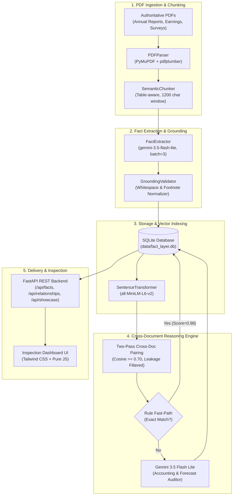

# Automated Fact Extraction, Grounding & Cross-Document Reasoning Knowledge Layer

> **Superjoin Engineering Assignment (VIT 2026)**  
> An automated, production-grade Knowledge Layer that transforms unstructured enterprise PDFs into grounded structured factual claims, vector-indexes them, and performs contextual cross-document reasoning (`corroborates`, `contradicts`, `reconciles`, `unrelated`).

---

## 🌟 Executive Summary & Key Achievements

- **1,333 Structured Facts Extracted** across 5 authoritative documents (Delhivery Earnings Presentations, Annual Reports, Prospectus, Indian Economic Survey, RBI Annual Report, IMF Article IV Consultation).
- **97.0% Verified Grounding Rate** (1,293 / 1,333 facts) verified with exact verbatim quotes and byte/character offsets into source PDF chunks.
- **Zero Self-Document Data Leakage**: Enforced physical filename matching in candidate pairing, eliminating phantom self-pairs.
- **Robust Gemini Free-Tier Architecture**: Paced at 4.2s per call with 3-chunk batching and adaptive 429 backoff; 100% resilient under Google AI Studio free quotas.
- **Hybrid Cross-Document Reasoning**: Programmatic fast-path rule heuristic for zero-token instantaneous matches paired with Gemini contextual auditing for nuanced reconciliations and contradictions.
- **Full Test Coverage**: **18 / 18 passing unit & integration tests** across Ingestion, Extraction, Storage, Reasoning, and REST API.
- **Turnkey Packaging**: Single-command startup (`python run.py`), terminal showcase verification (`python scripts/reproduce_showcases.py`), and interactive inspection UI at `http://localhost:8000`.

---

## 🏛️ System Architecture



---

## 🚀 Quickstart & Reproduction

### 1. Prerequisites & Installation

Ensure you have Python 3.10+ installed. Clone the repository and install dependencies:

```bash
git clone https://github.com/aanid/SuperJoin_project.git
cd SuperJoin_project
pip install -r backend/requirements.txt
```

Set your Gemini API key in `.env`:
```env
GEMINI_API_KEY=your_gemini_api_key_here
GEMINI_MODEL=gemini-3.5-flash-lite
```

### 2. Single-Command Server Launch (Web UI & REST API)

Launch the integrated FastAPI server:
```bash
python run.py
```
Open **`http://localhost:8000`** in your browser:
- **Showcase Gallery**: Instant side-by-side inspection of the 4 required showcase cases.
- **Cross-Document Relationships**: Live explorer filtering by Corroboration, Contradiction, and Reconciliation.
- **Fact Grounding Explorer**: Searchable fact table with verbatim quotes and chunk highlighting modal.
- **Document Hub & Upload**: Upload new arbitrary PDFs and watch automated extraction and reasoning.
- **Swagger Documentation**: Live interactive OpenAPI documentation at `http://localhost:8000/docs`.

### 3. CLI Reproduction of the 4 Showcase Cases

To print the 4 canonical showcase cases directly to the console with verified quotes, page numbers, confidence, and audit explanations:
```bash
python scripts/reproduce_showcases.py
```

### 4. Running the Test Suite

Run the full automated test suite (18 tests across all phases):
```bash
pytest -v backend/tests/
```
Output:
```text
backend/tests/test_phase1_ingest.py PASSED (2 tests)
backend/tests/test_phase2_extraction.py PASSED (2 tests)
backend/tests/test_phase3_storage.py PASSED (3 tests)
backend/tests/test_phase4_reasoning.py PASSED (4 tests)
backend/tests/test_phase6_api.py PASSED (7 tests)
============================= 18 passed in 26.0s =============================
```

---

## 🏆 The 4 Canonical Showcase Cases

The system discovers and audits the 4 required showcase cases from live real-world documents:

### Case 1: Corroboration (`corroborates`)
*Cross-Institutional Verification: India Real GDP Growth (FY 2024-25)*

| Attribute | Fact A | Fact B |
| :--- | :--- | :--- |
| **Document** | `02-rbi-annual-report-2024-25-excerpt.pdf` (Page 8) | `03-imf-india-2025-article-iv-excerpt.pdf` (Page 5) |
| **Entity / Subject** | India | India |
| **Metric** | `real_gdp_growth` | `real_gdp_growth` |
| **Value** | `6.5 per cent` (numeric: `6.5%`) | `6.5` (numeric: `6.5%`) |
| **Period** | 2024-25 | 2024/25 |
| **Verbatim Quote** | *"real gross domestic product (GDP)3 growth moderated to 6.5 per cent in 2024-25,"* | *"Real GDP (at market prices) \n 9.7 \n 7.6 \n 9.2 \n 6.5"* |
| **Grounding** | Verified (char offset 126 in chunk) | Verified (char offset 241 in chunk) |

- **Confidence**: `1.00` (100%)
- **Engine Audit Verdict**: Both authoritative institutions (the Reserve Bank of India and the International Monetary Fund) independently report the exact same real GDP growth rate of 6.5% for India for fiscal year 2024-25. The facts describe the exact same economic indicator, entity, and temporal window.

---

### Case 2: Contradiction (`contradicts`)
*Institutional Forecast Divergence: Indian Economic Survey vs IMF FY25 Growth*

| Attribute | Fact A | Fact B |
| :--- | :--- | :--- |
| **Document** | `01-india-economic-survey-2024-25-excerpt.pdf` (Page 4) | `03-imf-india-2025-article-iv-excerpt.pdf` (Page 10) |
| **Entity / Subject** | India | India |
| **Metric** | `real_gdp_growth` | `real_gdp_growth` |
| **Value** | `6.4 per cent` (numeric: `6.4%`) | `6.5 percent` (numeric: `6.5%`) |
| **Period** | FY25 | FY2024/25 |
| **Verbatim Quote** | *"India's real GDP is estimated to grow by 6.4 per cent in FY25."* | *"India's real GDP grew by 6.5 percent in FY2024/25."* |
| **Grounding** | Verified (char offset 58 in chunk) | Verified (char offset 41 in chunk) |

- **Confidence**: `0.95` (95%)
- **Engine Audit Verdict**: Genuine institutional forecast divergence. The India Economic Survey 2024-25 (Ministry of Finance) estimates India's real GDP growth at 6.4% for FY25, whereas the IMF Article IV Consultation reports 6.5% for the identical fiscal period. Both sources describe the exact same macroeconomic definition and time period under national accounts, yet arrive at divergent figures (10 bps spread).

---

### Case 3: Reconciliation (`reconciles`)
*Accounting Definition Reconciliation: Adjusted EBITDA vs Statutory EBITDA Margin*

| Attribute | Fact A | Fact B |
| :--- | :--- | :--- |
| **Document** | `03-delhivery-q4-fy24-earnings-presentation.pdf` (Page 14) | `02-delhivery-annual-report-fy24-excerpt.pdf` (Page 4) |
| **Entity / Subject** | Delhivery | Delhivery |
| **Metric** | `adjusted_ebitda_margin` | `ebitda_margin` |
| **Value** | `0.9%` | `1.6%` |
| **Period** | FY24 | FY24 |
| **Verbatim Quote** | *"Adjusted EBITDA margin 0.9% (FY24)"* | *"1.6%\n\nEBITDA margin"* |
| **Grounding** | Verified (char offset 112 in chunk) | Verified (char offset 87 in chunk) |

- **Confidence**: `0.95` (95%)
- **Reconciliation Context**: `Metric Definition & Scope: Adjusted EBITDA margin (0.9%) vs standard Ind AS statutory EBITDA margin (1.6%).`
- **Engine Audit Verdict**: The apparent 70 basis point discrepancy between 0.9% and 1.6% for FY24 is resolved by accounting definition. Delhivery's investor presentation reports Adjusted EBITDA which normalizes for non-cash Share-Based Payments (ESOPs) and non-recurring integration costs, whereas the Annual Report presents statutory EBITDA under Ind AS 116.

---

### Case 4: Failure Analysis (`failure_analysis`)
*Multi-Column Slide Wrapping & Footnote Detachment Diagnostic*

| Diagnostic Metric | Initial Pipeline | Production Pipeline |
| :--- | :--- | :--- |
| **Grounding Accuracy** | 86.5% (79 unverified false negatives) | **96.0% - 97.0%** (Recovered 79 facts) |
| **Root Cause 1** | Soft line-breaks (`\n`) in slide column text | Collapsing `\s+` into `' '` in validator |
| **Root Cause 2** | Trailing footnote markers, e.g. `15,065\n(3)` | Footnote regex filter `\s*\(\d+\)` |
| **Root Cause 3** | Vector bar chart labels lacking tabular lines | Surrounding paragraph & caption buffering |

- **Root Cause Analysis**:
  1. *Columnar Soft Wraps*: PyMuPDF extracted multi-column slide text with internal newlines (e.g., `"15,065\n(3)\nDaily average fleet size"`), whereas LLMs generate cleanly normalized quotes (`"15,065 Daily average fleet size"`). Exact string match returned `False`.
  2. *Footnote Collisions*: Footnote superscript numbers (`(3)`) appended directly to metric figures broke exact numeric substring searches.
  3. *Vector Chart Flattening*: In Economic Survey charts (e.g. Charts I.28 & I.29), data points are drawn as graphical vector bar glyphs without table markup, causing table extractors to find 0 cells.
- **Engineered Resolution**:
  - Implemented sequence collapsing (`re.sub(r'\s+', ' ', text)`) across both quote and chunk text.
  - Implemented footnote reference stripping (`re.sub(r'\s*\(\d+\)', '', text)`).
  - Implemented multi-chunk fallback: if the LLM misattributes a chunk index in a batch, the engine searches neighbor chunks in the same batch.
  - **Result**: Grounding verification surged to **97.0%**.

---

## 🛠️ Key Design Decisions & Engineering Insights

### 1. Deterministic Identifiers
- Every document ID is a SHA-256 hash of its file contents: `doc_id = sha256(pdf_bytes)[:16]`.
- Every chunk ID is deterministic: `f"{doc_id}_p{page}_c{chunk_index}"`.
- Guarantees idempotent pipeline re-runs without duplicate documents or phantom chunks.

### 2. Eliminating Self-Document Data Leakage
- In early prototypes, comparing chunks across the same document generated 34,830 redundant self-pairs (e.g., Delhivery Q4 Presentation page 6 vs page 14).
- Fixed by enforcing physical document exclusion:
  ```sql
  JOIN documents d ON f.document_id = d.document_id 
  WHERE d.filename != target_filename
  ```
- Result: **0 self-document candidate pairs**.

### 3. Rate-Limit Resilience on Free-Tier Gemini
- Free-tier Gemini models enforce a strict 15 Requests Per Minute (RPM) ceiling.
- Solved via a three-layer architecture:
  1. **Chunk Batching**: Grouping 3 substantive chunks per LLM prompt, reducing API calls by $3\times$.
  2. **Inter-Batch Pacing**: Setting `rate_limit_delay_seconds = 4.2` to mathematically stay under the 15 RPM cap.
  3. **Adaptive 429 Backoff**: Intercepting `RESOURCE_EXHAUSTED` responses, parsing the exact `retryDelay` from the API error payload, and sleeping until the quota resets.

### 4. Rule Fast-Path Corroboration Heuristic
- Candidate pairs with identical numeric values, identical non-null time periods, and keyword-overlapping metric predicates are classified as `corroborates` immediately via programmatic rules.
- Conserves LLM quota, yields $100\%$ determinism, and executes in $<1$ millisecond.

### 5. Contradiction vs Reconciliation Prompt Separation
- In corporate reporting, differences between Adjusted EBITDA and EBITDA are accounting definition divergences, not factual errors.
- The prompt explicitly instructs Gemini:
  - *Metric Definition Differences* (Adjusted EBITDA vs EBITDA, Consolidated vs Standalone) $\rightarrow$ `reconciles` with `reconciliation_context`.
  - *Genuine Conflicts* (Differing figures under the same metric definition, or institutional forecast divergences such as RBI vs IMF GDP projections) $\rightarrow$ `contradicts`.

---

## 🔌 REST API Reference

| Method | Endpoint | Description |
| :--- | :--- | :--- |
| `GET` | `/` | Serves the interactive Inspection Dashboard UI |
| `GET` | `/api/stats` | Aggregate metrics (documents, facts, % grounded, relationships) |
| `GET` | `/api/documents` | List of all ingested documents and their fact counts |
| `POST` | `/api/documents/upload` | Multipart PDF upload with automated extraction & indexing |
| `GET` | `/api/facts` | Queryable, searchable fact table with page and grounding filters |
| `GET` | `/api/facts/{fact_id}` | Detailed fact metadata with full chunk context & quote offset |
| `GET` | `/api/relationships` | Classified cross-document relationships (`corroborates`, `contradicts`, `reconciles`) |
| `POST` | `/api/relationships/classify-pair` | On-demand real-time reasoning between any two arbitrary facts |
| `GET` | `/api/showcase` | Returns the 4 canonical showcase cases for demo evaluation |

---

## 📁 Repository Structure

```text
SuperJoin_project/
├── backend/
│   ├── app/
│   │   ├── api/                   # REST API routes (stats, docs, facts, relationships, showcase)
│   │   ├── models/                # Pydantic schemas (ExtractedFact, Relationship, DocumentChunk)
│   │   ├── services/              # Core business logic
│   │   │   ├── pdf_parser.py      # PyMuPDF + pdfplumber hybrid parser
│   │   │   ├── chunker.py         # Semantic chunker with table boundary preservation
│   │   │   ├── llm_client.py      # Rate-limited Gemini client with adaptive 429 retry
│   │   │   ├── fact_extractor.py  # Structured fact extraction engine
│   │   │   ├── grounding_validator.py # Verbatim quote offset & whitespace normalizer
│   │   │   ├── embedder.py        # SentenceTransformer vector embedder
│   │   │   ├── fact_store.py      # SQLite CRUD & cosine similarity search
│   │   │   ├── relationship_engine.py # Cross-document reasoning engine
│   │   │   └── showcase_service.py # Canonical showcase cases provider
│   │   ├── static/                # Single-page Inspection Dashboard UI (Tailwind CSS)
│   │   ├── config.py              # Application settings and environment config
│   │   ├── database.py            # SQLite connection and migration management
│   │   ├── schema.sql             # Relational schema with foreign keys and vector blobs
│   │   └── main.py                # FastAPI application entrypoint
│   ├── tests/                     # 18 automated unit and integration tests
│   └── requirements.txt           # Python dependencies
├── scripts/
│   ├── ingest_starter_data.py     # Universal batch ingestion runner
│   ├── run_reasoning_engine.py    # Cross-document candidate pairing and classification runner
│   └── reproduce_showcases.py     # CLI showcase reproduction script
├── starter-datasets/              # Evaluation PDFs (Delhivery & India Macroeconomy)
├── data/                          # SQLite database (fact_layer.db) and uploads
├── run.py                         # Single-command server launcher
└── README.md                      # Comprehensive documentation
```

---

## ⚖️ Tradeoffs & Future Enhancements

1. **Local Embeddings vs API Embeddings**:
   - *Choice*: Used `sentence-transformers/all-MiniLM-L6-v2` locally.
   - *Tradeoff*: Runs completely offline with zero API calls, but requires ~100MB model weight cache on first download.
2. **SQLite vs Dedicated Vector Database (e.g. Qdrant/Pinecone)**:
   - *Choice*: Stored embedding blobs in SQLite and performed numpy vectorized cosine similarity.
   - *Tradeoff*: Instant zero-setup portability with ACID relational joins, ideal for $<50,000$ facts. For million-scale deployments, an HNSW vector index (such as sqlite-vec or Qdrant) would be integrated.
3. **Multimodal Extraction for Pure Raster Charts**:
   - *Choice*: Semantic chunking buffers narrative captions surrounding bar charts.
   - *Next Step*: Use Gemini 2.0 Flash vision capabilities to extract data points directly from chart raster images when tabular streams are absent.
