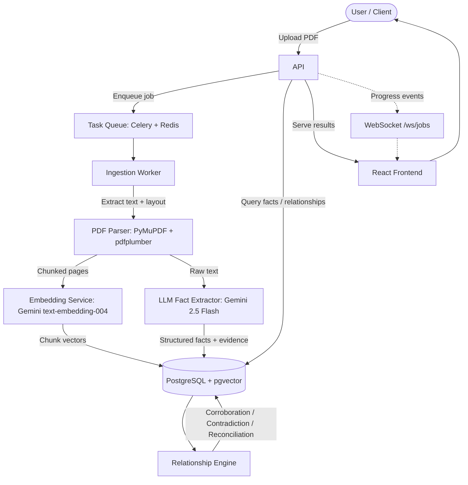

# Fact Knowledge Layer — Master Implementation Plan
### SuperJoin VIT 2026 Engineering Intern Assignment

**Purpose of this document:** This is the single source of truth for the build. It is written to be broken into smaller phase-by-phase prompts for a coding agent during an overnight build session. Every phase has a concrete "done when" checkpoint so you (or the agent) can verify progress without ambiguity instead of guessing whether something "works."

**Scope decision:** Full feature set retained — Celery + Redis async pipeline, WebSocket live progress, React Flow relationship graph, all four brownie points. Nothing is cut from the original architecture. What changed from the first draft is *sequencing, specification depth, and verification gates* — every stage now has exact prompts, exact schemas, and exact pass/fail criteria so an agent coding fast overnight doesn't drift.

---

## 0. Constraints & Ground Rules

- **Deadline:** tomorrow. This plan is time-boxed hour-by-hour in Section 12.
- **Method:** vibe-coded with an AI coding agent, executed in phases.
- **Budget:** ₹100–200 total on LLM API spend. See Section 1 for the provider decision.
- **Non-negotiables from the brief:**
  - No hard-coded facts, filenames, schemas, or document-specific rules — the system must generalize to unseen PDFs.
  - Every fact must be grounded in a verbatim quote + page number from its source document.
  - All four cases (corroboration, contradiction, reconciliation, failure analysis) must be demonstrable with real evidence, not staged.
  - "A graph database or visualization alone is not the solution" — the graph view is a bonus surface, not where the grading weight lives. The written explanation + evidence per relationship is what's being evaluated.
  - A smaller, *understandable* system beats a large one with unclear behavior — every design choice below should be explainable in one sentence during the video demo.

---

## 1. LLM Provider Decision

**Recommendation: start and finish on Gemini 2.5 Flash, with structured output (`response_schema`), and keep GPT-4o-mini as a documented fallback only if something breaks.**

Reasoning:

| Factor | Gemini 2.5 Flash | GPT-4o-mini |
|---|---|---|
| Free tier | Yes — no card required, ~15 RPM / ~1,000–1,500 requests per day on Flash | No standing free tier |
| Paid cost (if you exceed free tier) | ~$0.30 / 1M input, ~$2.50 / 1M output tokens | Comparable order of magnitude, slightly higher on some benchmarks |
| Structured JSON output | Native `response_schema` / JSON mode, reliable | Native JSON mode, reliable |
| Your budget (₹100–200 ≈ $1.2–2.4) | Comfortably covers the whole project even fully on paid tier | Also fits, but you'd be starting from $0, not free |

**Concrete plan:**
1. Start entirely on the **free tier** (Google AI Studio API key, no billing enabled). This costs ₹0.
2. The free tier's binding constraint is **rate limit (RPM), not quality or daily volume** — at ~15 requests/minute you can still process the full starter dataset overnight, it just serializes calls. Build the extraction/relationship services with a simple retry-with-backoff wrapper from the start (Section 6, Stage 4) so this is a non-issue rather than a 2am debugging session.
3. **Enable billing only if you hit a wall** (e.g., you want to parallelize Celery workers and blow through daily quota). At that point cost is trivial — the entire 6-PDF dataset, including a generous number of relationship-classification calls, will land well under $1 even on the paid tier. You have 2–4x budget headroom.
4. **Don't split providers mid-build.** Switching from free→paid Gemini is a one-line config change (add billing to the same Google Cloud project, same API, same code). Switching from Gemini→GPT is a rewrite of every prompt/schema call. Pick Gemini once and don't revisit this decision under time pressure.
5. Use **Gemini 2.5 Flash** (not Flash-Lite) for both extraction and relationship classification — Flash-Lite is cheaper but this task (numeric fact extraction, contradiction reasoning) benefits from the stronger model, and the cost difference at this scale is fractions of a rupee.

**Action item before coding starts:** get a Gemini API key from Google AI Studio (free, instant, no card), put it in `.env` as `GEMINI_API_KEY`, and do not build an OpenAI adapter unless the fallback is actually triggered.

---

## 2. Final Architecture (unchanged in scope, sequenced for build order)



**Stack (final):**

| Layer | Choice | Notes |
|---|---|---|
| Language | Python 3.12 | |
| Web framework | FastAPI | async, auto-docs |
| Task queue | Celery + Redis | kept per your instruction — gives real async processing + a legitimate "large PDFs / many PDFs" story for brownie points |
| Database | PostgreSQL 16 + pgvector | unified relational + vector store |
| PDF parsing | PyMuPDF (fitz) + pdfplumber | fitz for text/layout, pdfplumber for tables |
| LLM | **Gemini 2.5 Flash** (`google-genai` SDK) | structured output via `response_schema` |
| Embeddings | **Gemini `text-embedding-004`** (768-dim) | replaces OpenAI embeddings — same role, zero cost on free tier |
| Frontend | React 19 + Vite + Tailwind | |
| Graph vis | React Flow | secondary surface, not the core deliverable |
| Containerization | Docker Compose | one-command run, `depends_on` + healthchecks added (see Section 9) |
| ORM | SQLAlchemy 2.0 async | |
| Migrations | Alembic | |

**Important change from the original draft:** embeddings move from OpenAI `text-embedding-3-small` (1536-dim) to **Gemini `text-embedding-004`** (768-dim) to keep everything on one provider/one API key/one bill. Update the `VECTOR(1536)` columns in the schema below to `VECTOR(768)` accordingly — this is already reflected in Section 3.

---

## 3. Data Model (authoritative — build Alembic migrations directly from this)

### `documents`
```sql
CREATE TABLE documents (
    id           UUID PRIMARY KEY DEFAULT gen_random_uuid(),
    filename     TEXT NOT NULL,
    title        TEXT,
    doc_type     TEXT,                 -- 'annual_report' | 'prospectus' | 'earnings_presentation' | 'regulatory_report' | 'research_report' | 'other'
    source_url   TEXT,
    period_start DATE,
    period_end   DATE,
    publisher    TEXT,
    total_pages  INTEGER,
    status       TEXT NOT NULL DEFAULT 'pending',  -- pending | processing | done | error
    error_msg    TEXT,
    uploaded_at  TIMESTAMPTZ DEFAULT now(),
    processed_at TIMESTAMPTZ
);
```

### `document_chunks`
```sql
CREATE TABLE document_chunks (
    id           UUID PRIMARY KEY DEFAULT gen_random_uuid(),
    document_id  UUID REFERENCES documents(id) ON DELETE CASCADE,
    page_number  INTEGER,
    chunk_index  INTEGER,
    chunk_text   TEXT NOT NULL,
    section_path TEXT,
    embedding    VECTOR(768),          -- Gemini text-embedding-004
    created_at   TIMESTAMPTZ DEFAULT now()
);
CREATE INDEX ON document_chunks USING hnsw (embedding vector_cosine_ops);
CREATE INDEX ON document_chunks (document_id, page_number);
```

### `facts`
```sql
CREATE TABLE facts (
    id              UUID PRIMARY KEY DEFAULT gen_random_uuid(),
    document_id     UUID REFERENCES documents(id) ON DELETE CASCADE,
    chunk_id        UUID REFERENCES document_chunks(id),
    fact_type       TEXT NOT NULL,
    subject         TEXT NOT NULL,
    predicate       TEXT NOT NULL,
    object_value    TEXT,
    numeric_value   NUMERIC,
    unit            TEXT,
    period          TEXT,
    period_start    DATE,
    period_end      DATE,
    scope           TEXT,
    confidence      FLOAT,
    low_confidence  BOOLEAN GENERATED ALWAYS AS (confidence < 0.6) STORED,
    qualifiers      JSONB,
    verbatim_quote  TEXT NOT NULL,
    page_number     INTEGER NOT NULL,
    embedding       VECTOR(768),
    created_at      TIMESTAMPTZ DEFAULT now()
);
CREATE INDEX ON facts USING hnsw (embedding vector_cosine_ops);
CREATE INDEX ON facts (document_id);
CREATE INDEX ON facts (fact_type, subject, predicate);
CREATE INDEX ON facts (period_start, period_end);
```
*(Note: added a computed `low_confidence` column so the UI/filter logic in Section 8 doesn't need to duplicate the `< 0.6` threshold everywhere.)*

### `fact_relationships`
```sql
CREATE TABLE fact_relationships (
    id                      UUID PRIMARY KEY DEFAULT gen_random_uuid(),
    fact_a_id               UUID REFERENCES facts(id) ON DELETE CASCADE,
    fact_b_id               UUID REFERENCES facts(id) ON DELETE CASCADE,
    relationship            TEXT NOT NULL,   -- 'corroborates' | 'contradicts' | 'reconciles'
    confidence              FLOAT,
    explanation             TEXT NOT NULL,
    reconciliation_context  TEXT,
    detected_by             TEXT DEFAULT 'auto',  -- 'auto' | 'manual'
    created_at              TIMESTAMPTZ DEFAULT now(),
    UNIQUE (fact_a_id, fact_b_id)
);
CREATE INDEX ON fact_relationships (fact_a_id);
CREATE INDEX ON fact_relationships (fact_b_id);
CREATE INDEX ON fact_relationships (relationship);
```

### `processing_jobs`
```sql
CREATE TABLE processing_jobs (
    id             UUID PRIMARY KEY DEFAULT gen_random_uuid(),
    document_id    UUID REFERENCES documents(id),
    celery_task_id TEXT,
    stage          TEXT,     -- 'parse' | 'embed' | 'extract' | 'relate'
    status         TEXT,     -- 'pending' | 'running' | 'done' | 'error'
    progress       INTEGER,  -- 0-100
    log            TEXT,
    started_at     TIMESTAMPTZ,
    finished_at    TIMESTAMPTZ
);
```

---

## 4. Repo Structure

```
fact-knowledge-layer/
├── backend/
│   ├── app/
│   │   ├── main.py
│   │   ├── config.py
│   │   ├── database.py
│   │   ├── models/{document,chunk,fact,relationship}.py
│   │   ├── schemas/{document,fact,relationship}.py
│   │   ├── api/{documents,facts,relationships,search}.py
│   │   ├── services/
│   │   │   ├── pdf_parser.py
│   │   │   ├── chunker.py
│   │   │   ├── embedder.py           # Gemini text-embedding-004
│   │   │   ├── fact_extractor.py     # Gemini 2.5 Flash, structured output
│   │   │   ├── relationship_engine.py
│   │   │   ├── document_classifier.py
│   │   │   └── llm_client.py         # shared Gemini client w/ retry+backoff
│   │   └── worker/{celery_app,tasks}.py
│   ├── alembic/
│   ├── tests/
│   ├── pyproject.toml
│   └── Dockerfile
├── frontend/
│   └── src/
│       ├── pages/{HomePage,DocumentPage,RelationshipsPage,SearchPage}.tsx
│       ├── components/{UploadDropzone,ProcessingStatus,FactCard,FactTable,RelationshipCard,RelationshipGraph,EvidencePanel}.tsx
│       ├── hooks/{useDocuments,useFacts,useRelationships,useJobStatus}.ts
│       └── lib/api.ts
├── data/                              # starter PDFs, gitignored except a README pointer
├── docker-compose.yml
├── .env.example
└── README.md
```

---

## 5. Stage-by-Stage Pipeline Spec

### Stage 1 — PDF Parsing (`services/pdf_parser.py`)
1. Open with PyMuPDF. Per page: extract text blocks + bounding boxes.
2. Detect section headers via font-size/bold heuristic + regex (`^\d+\.`, ALL-CAPS lines).
3. Extract tables via pdfplumber → Markdown table string, attached to the chunk that contains them.
4. Skip image-only pages (text length < 50 chars) — log them, don't silently drop (feeds Case 4 failure analysis: "no OCR" limitation).
5. Build `section_path` breadcrumb (e.g. `"MD&A > Revenue > Quarterly Performance"`).

**Chunking (`services/chunker.py`):**
- ≤ 800 tokens/chunk (tiktoken or Gemini's tokenizer equivalent — use a simple word-count proxy if the exact Gemini tokenizer isn't convenient, it doesn't need to be exact).
- Split on paragraph → sentence boundaries.
- 150-token overlap between chunks.
- Prefix each chunk with its `section_path` for embedding quality.

**Done when:** running the parser on all 6 starter PDFs produces chunks in `document_chunks` with non-null `section_path` for at least 80% of chunks, and zero unhandled exceptions.

### Stage 2 — Document Classification (`services/document_classifier.py`)
Send first ~2,000 chars to Gemini 2.5 Flash with `response_schema` enforcing:
```json
{
  "title": "string",
  "doc_type": "annual_report | prospectus | earnings_presentation | regulatory_report | research_report | other",
  "publisher": "string",
  "period_start": "YYYY-MM-DD or null",
  "period_end": "YYYY-MM-DD or null",
  "scope": "string"
}
```
**Done when:** all 6 starter PDFs get a sensible `doc_type` and non-null `publisher` without any per-file special-casing in code.

### Stage 3 — Embedding (`services/embedder.py`)
- Batch chunks to `text-embedding-004`.
- Store 768-dim vectors on `document_chunks.embedding`.
- Same embedding call reused for facts (Stage 4) — one embedder service, two callers.

**Done when:** every chunk and every fact has a non-null embedding after a full pipeline run.

### Stage 4 — LLM Fact Extraction (`services/fact_extractor.py`)
Core intelligence layer. Per chunk, call Gemini 2.5 Flash with a JSON `response_schema` array of:
```json
{
  "fact_type": "string",
  "subject": "string",
  "predicate": "string",
  "object_value": "string",
  "numeric_value": "number | null",
  "unit": "string | null",
  "period": "string | null",
  "period_start": "YYYY-MM-DD | null",
  "period_end": "YYYY-MM-DD | null",
  "scope": "string | null",
  "confidence": "number 0-1",
  "qualifiers": "object",
  "verbatim_quote": "string, <=150 chars, must be an exact substring of the input chunk"
}
```
System prompt instructs: *"A fact is an atomic claim about a measurable or defined property of a named subject. Prefer numerical and categorical facts with clear evidence. Normalize the subject entity name to its canonical form (e.g. 'the Company' → 'Delhivery Limited') using context from the document title and prior mentions."* — this directly addresses the Case 4 "entity resolution" failure mode by trying to solve it in the prompt first, then documenting where it still fails.

Inject document metadata (`title`, `period_start/end`, `publisher`) into every extraction prompt so relative references ("last year", "the Company") can be anchored — this is the concrete mitigation for the "period ambiguity" failure mode from the original plan.

**Quality controls (unchanged from original draft, still correct):**
- Confidence < 0.6 → store but flag `low_confidence` (now a generated column).
- Dedup: cosine similarity > 0.95 against existing facts **in the same document** → skip.
- Validate `verbatim_quote` is an actual substring of the source chunk before insert; if not, either fuzzy-match it back to the nearest matching text or discard the fact and log it — never store an ungrounded quote.

**Rate-limit handling (new, required given free-tier Gemini):** wrap every Gemini call in `llm_client.py` with exponential backoff + jitter on 429s, and a simple in-process token-bucket limiter set just under the free-tier RPM so you don't need to think about this during the overnight run.

**Done when:** each of the 6 PDFs yields 50–300 facts, ≥95% of `verbatim_quote` values are verified substrings of their source chunk, and spot-checking 10 random facts against the PDF by hand confirms they're real.

### Stage 5 — Relationship Detection (`services/relationship_engine.py`)

**5a — Candidate selection**
```sql
SELECT id, subject, predicate, object_value, numeric_value, unit, period, document_id
FROM facts
WHERE document_id != :new_doc_id
ORDER BY embedding <=> :new_embedding
LIMIT 20;
```
Filter to subject-similarity > 0.7 OR predicate exact-match. Skip pairs already in `fact_relationships`.

**5b — Numeric pre-screen (before any LLM call):** if both facts are numeric and `|a-b|/max(|a|,|b|) < 0.02`, mark `corroborates` at confidence 0.9 directly — saves tokens and is strictly more reliable than an LLM call for this narrow case.

**5c — LLM classification** for everything else, Gemini 2.5 Flash with `response_schema`:
```json
{
  "relationship": "corroborates | contradicts | reconciles | unrelated",
  "confidence": "number 0-1",
  "explanation": "string, 2-3 sentences",
  "reconciliation_context": "string | null, required if relationship == reconciles"
}
```
Only store `corroborates` / `contradicts` / `reconciles`; discard `unrelated`.

**Relationship semantics (unchanged, these are correct):**
- `corroborates`: same claim, overlapping period, values consistent within tolerance.
- `contradicts`: same claim/period/scope, incompatible values, no contextual explanation.
- `reconciles`: values differ but period/scope/unit/basis explains it.

**Explicit caveat to document in README Limitations:** `reconciliation_context` is LLM-generated reasoning, not independently verified — treat it as a hypothesis the system proposes, not ground truth. State this plainly rather than presenting it as verified fact.

**Done when:** running relationship detection across all 6 documents produces at least one instance of each of `corroborates`, `contradicts`, `reconciles`, and every stored relationship links to two facts that both have valid page numbers and verbatim quotes you can pull up and check by eye.

---

## 6. The Four Required Cases — Verification-First, Not Assumption-First

**Do this before writing any relationship-engine code, as a 20-minute manual pass:** open the 6 PDFs and actually locate candidate numbers for each case. The original draft used "may report" / "may cite" language for Cases 2 and 3 — that's a real risk; if the numbers don't diverge the way hoped, there's no case. Treat the table below as *targets to verify*, not confirmed facts.

| Case | Primary target | Verification step | Fallback if it doesn't pan out |
|---|---|---|---|
| 1. Corroboration | Delhivery FY24 revenue in Annual Report vs Q4 Presentation | grep both PDFs for "revenue" near "8,109" or the actual figure | any other metric repeated in two Delhivery documents (headcount, EBITDA, delivery volume) |
| 2. Contradiction | GDP growth FY24-25: Economic Survey vs RBI vs IMF Article IV | pull the actual three numbers first | Delhivery director/leadership role named differently in Prospectus (2022) vs Annual Report (FY24) — check the board/management sections directly |
| 3. Reconciliation | CPI inflation: RBI (fiscal-year avg) vs IMF (different basis) | pull actual numbers + check if a reason is stated in either doc | Delhivery revenue across Prospectus (2022) vs Annual Report (FY24) — different fiscal years, should NOT be flagged as contradiction; use as the reconciliation example instead |
| 4. Failure analysis | Table extraction misparse, or an entity-resolution duplicate, or a low-confidence qualitative "fact" | this doesn't need to be found — it needs to be *observed and written up* from whatever actually happens when you run the pipeline | — |

**Primary demo dataset: Delhivery** (more contained, easier to narrate in 3 minutes). **India Macroeconomy is the reconciliation showcase** (Case 3) since it's structurally the strongest fit for that case — but confirm the actual numbers before scripting the demo.

For all three of Cases 1–3, the video and README must show: the two verbatim quotes, their page numbers/documents, and the system's generated explanation — not just the relationship label.

---

## 7. API Design (unchanged from original draft — it was already solid)

**Documents:** `POST /api/documents/upload`, `GET /api/documents`, `GET /api/documents/{id}`, `DELETE /api/documents/{id}`, `GET /api/documents/{id}/status`

**Facts:** `GET /api/facts` (filter: `document_id`, `fact_type`, `subject`, `period`), `GET /api/facts/{id}`, `GET /api/facts/types`

**Relationships:** `GET /api/relationships` (filter: `type`, `document_id`), `GET /api/relationships/{id}`, `POST /api/relationships/rerun`

**Search:** `GET /api/search?q=...&doc_ids=...`

**WebSocket:** `WS /ws/jobs/{job_id}` — live progress during processing.

---

## 8. Frontend (unchanged from original draft)

```
pages/: HomePage, DocumentPage, RelationshipsPage, SearchPage
components/: UploadDropzone, ProcessingStatus, FactCard, FactTable,
             RelationshipCard, RelationshipGraph (React Flow), EvidencePanel
hooks/: useDocuments, useFacts, useRelationships, useJobStatus (WS)
```

UI flow: upload → progress → document fact table (click row → evidence panel with verbatim quote + page) → relationships view grouped by type, with a graph toggle → search.

**One addition:** surface `low_confidence` facts in a visually distinct, separately-filterable section of the fact table rather than mixed in — this is minimal extra work and directly demonstrates "sensible handling of ambiguity" from the grading criteria.

---

## 9. Docker Compose

Same 5 services as the original draft (`db`, `redis`, `backend`, `worker`, `frontend`), with one fix: add `depends_on` with `condition: service_healthy` for `db` and `redis`, and a `healthcheck` block on the `db` service (`pg_isready`). This avoids the classic first-run failure where the backend boots before Postgres is ready — cheap to add, saves a debugging cycle at 2am.

```env
GEMINI_API_KEY=...
DATABASE_URL=postgresql+asyncpg://user:password@db:5432/factlayer
REDIS_URL=redis://redis:6379/0
UPLOAD_DIR=/app/uploads
MAX_FILE_SIZE_MB=50
EMBEDDING_BATCH_SIZE=100
FACT_CONFIDENCE_THRESHOLD=0.6
RELATIONSHIP_SIMILARITY_THRESHOLD=0.75
GEMINI_FREE_TIER_RPM_LIMIT=12   # stay just under published free-tier RPM
```

---

## 10. Brownie Points — Implementation Notes (all four kept)

- **Large PDFs:** page-batching via `asyncio.gather` in Celery tasks (batches of 10), 800-token chunk cap, page-level importance filter for docs > 200 pages (skip pages with < 3 facts and no table).
- **Many PDFs in one layer:** shared `facts` table keyed by `document_id`, HNSW index scales fine at this size, 20-candidate cap on relationship search.
- **Dynamic schema:** `fact_type`/`predicate`/`qualifiers` stay free-text; `/api/facts/types` populates the UI filter dynamically — already covered by the data model, no extra work needed.
- **Incremental processing:** new document → extract facts for it only → relationship engine queries existing `facts` table for candidates → old relationships untouched. This is close to free given the data model — verify it explicitly with a test (add a 7th arbitrary PDF after the initial 6 are processed, confirm no reprocessing of the original 6 occurs and new relationships appear).

---

## 11. Failure Analysis — What To Actually Look For (Case 4)

Don't fabricate a failure. Instrument the pipeline to surface real ones:
1. Log every page skipped as image-only, and every table-heavy page — check afterward if any of these produced a wrong or missing fact.
2. Log every fact where `verbatim_quote` failed exact-substring validation — this alone will likely surface a real extraction failure worth writing up.
3. Log every pair of facts with the same `subject` string that differ only in casing/suffix ("Delhivery" vs "Delhivery Limited") *before* the entity-normalization prompt — compare against after, to show whether the mitigation actually worked or only partially worked. A partial fix honestly reported is a better Case 4 than a fake failure.
4. Pull 5 random `low_confidence` facts and check by hand whether they're genuinely low-value (good) or actually solid facts the model under-scored (a real calibration failure worth reporting).

---

## 12. Overnight Execution Schedule (time-boxed)

Adjust anchors to your actual start time; the ordering and proportions are what matter.

| Block | Duration | Work |
|---|---|---|
| 1 | 30 min | Repo scaffold, Docker Compose skeleton, `.env`, Gemini API key, Alembic migrations from Section 3 schema |
| 2 | 20 min | Manual verification pass on the 6 PDFs for Section 6 (find real Case 2/3 numbers before building around them) |
| 3 | 60 min | Stage 1–2: PDF parser + chunker + document classifier, run against all 6 PDFs, hit the Stage 1/2 "done when" bars |
| 4 | 45 min | Stage 3: embedder service, backfill embeddings |
| 5 | 90 min | Stage 4: fact extractor with retry/backoff + validation, run full extraction on all 6 PDFs, spot-check facts |
| 6 | 90 min | Stage 5: relationship engine (pre-screen + LLM classification), run across all documents, confirm all three relationship types present with real evidence |
| 7 | 60 min | Celery/Redis wiring + WebSocket progress (these can be added around an already-working synchronous pipeline — don't let this block Stage 4/5 from being verified first) |
| 8 | 90 min | FastAPI routes wired to real data |
| 9 | 90 min | React frontend: upload → document view → relationship cards → evidence panel |
| 10 | 45 min | React Flow graph view + search page |
| 11 | 30 min | Case 4 write-up from logs gathered in Section 11 |
| 12 | 45 min | README (all required sections) + record 3-minute demo video |
| 13 | buffer | Whatever slipped |

**Principle if time gets tight:** keep the pipeline (Stages 1–5) and the four cases airtight before polishing Celery/WebSocket/graph-view UX — those are the parts a reviewer actually grades against the brief's stated criteria ("useful facts grounded in PDFs," "sensible handling of ambiguity," "clear engineering decisions"). This isn't a scope cut, it's just the order that protects the required deliverable if Block 13's buffer runs out.

---

## 13. Pre-Submission Checklist

- [ ] Runs from clean clone with `docker compose up` per README instructions.
- [ ] Accepts a new, unseen PDF through the UI/API and processes it without code changes.
- [ ] Every fact shown in the UI has a verbatim quote + page number + source document.
- [ ] All four cases demonstrated with real evidence (not asserted) in both the UI and the video.
- [ ] `reconciliation_context` explicitly labeled as system-generated reasoning, not verified ground truth, somewhere visible (UI copy or README).
- [ ] README has all five required sections: Setup and Run, Video Demo, Approach, Limitations and Next Steps, Additional Notes.
- [ ] `.env.example` present, no real API key committed anywhere in git history.
- [ ] Demo video ≤ 3 minutes, shows a PDF being processed live and all four cases.
- [ ] Google Form submitted with repo + video links.
